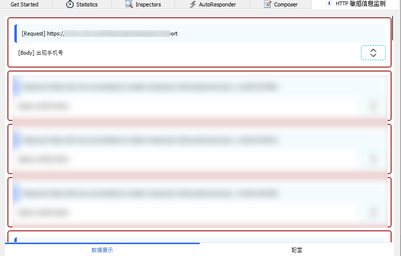

# HTTP 请求敏感信息检查插件

一个 Fiddler 插件，帮你检查 HTTP 请求和响应中的敏感信息(或者其它关心的数据，可自行配置)。  
检查的内容：请求和响应的 Url，Header 和 Body。

## 🍕 Fiddler 插件安装

在 [Release](https://github.com/JasonGrass/Fiddler.HttpPrivateInfoCheck/releases) 中下载插件 ZIP 包，
将 ZIP 中所有的文件(夹)，拷贝到 Fidddler 的插件目录中。

`%USERPROFILE%\Documents\Fiddler2\Scripts`

## 🍔 插件的使用 - 快速开始

启动 Fiddler，将看到 `HTTP 敏感信息检测` 标签。

在`配置`界面中，定义需要匹配的 Host，添加一条规则，如

``` bash
匹配模式：字符串
pattern 值：17712341234
命中提示：出现手机号
```

> 如这个配置所见，插件并不能帮你自动智能地判断哪些字符串是手机号，需要显式地指定。测试时，使用对应的手机号登录应用/网站。
>
> 如果需要更复杂的匹配检查，可以使用正则表达式。如这里可以写成 177\d{4}1234 是类似的效果。

保存并开启检测，使用对应的账号登录软件并使用，当 HTTP 请求或响应中出现指定的字符串，则会在`数据展示`中给出提示。



## 🍟 配置

### 匹配的 Host

在这里设置关系的 Host，这里的 Host 不必是完整的，如可以写 `example.com` 来匹配 `a.example.com` 和 `b.example.com` 等。

### 排除的 Host

此项的优先级比匹配的 Host 高。实际使用中，可以用于排除不关心的二级域名。
如匹配的 Host 中写的是 `example.com`，但不关心 `music.example.com` 的请求，则可以将 `music.example.com` 设置为排除的 Host。

### 规则

插件将检查请求和响应中的 Url, Header 和 Body 中的数据（字符串）。

* 字符串匹配模式
采用字符串包含模式，如果出现了指定的值，则产生提示。

* 正则表达式模式
使用正则表达式进行匹配，如果出现了匹配，则产生提示。

命中提示是规则匹配之后，在 `数据展示` 界面给出的直观提示，如：“出现了手机号”。

### 配置的保存与加载

修改配置之后，需要点击保存，配置数据将保存到本地的 `%AppData%\FiddlerPlugin.HttpPrivateInfoCheck\config.json` 文件中。
启动 Fiddler 时加载插件时，将自动从该文件加载配置。

## 🥓 插件开发与调试

编译项目时，会自动将输出拷贝到 Fiddler 的插件目录，此时需要先将 Fiddler 进程退出。

调试：编译完成之后，启动 Fiddler，然后使用 VS 附加到进程（Fiddler进程）进行断点调试。

[JasonGrass/Fiddler.Plugin.SDK: Fiddler 插件开发 SDK](https://github.com/JasonGrass/Fiddler.Plugin.SDK )  
[Fiddler 插件开发，使用 WPF 作为 UI 控件 - J.晒太阳的猫 - 博客园](https://www.cnblogs.com/jasongrass/p/12039575.html )

WPF UI 库  
[HandyOrg/HandyControl: Contains some simple and commonly used WPF controls](https://github.com/HandyOrg/HandyControl )
